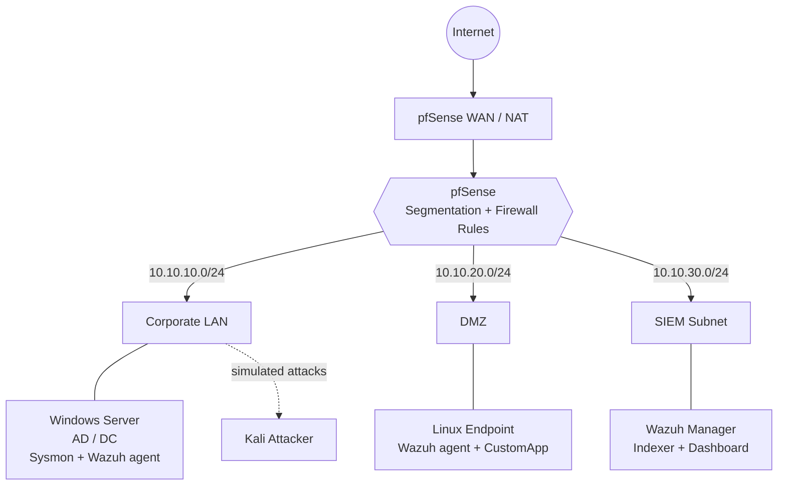
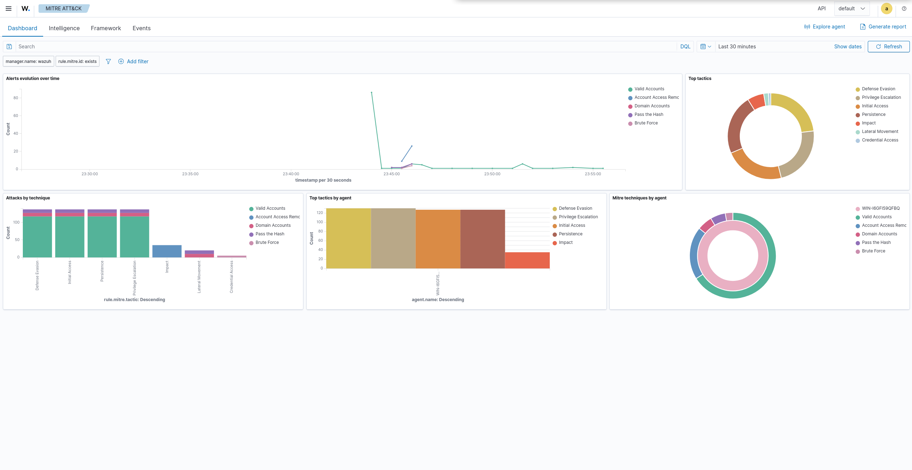

# SOC Detection Lab - Segmented Network, Wazuh SIEM & Custom Detections

A self-built security operations lab: a **pfSense-segmented network** (Corporate
LAN / DMZ / SIEM subnet), centralized detection with **Wazuh** across a **Windows
Active Directory** domain controller and a **Linux** endpoint, **custom decoders
and correlation rules**, and detections validated against **simulated attacks**
from Kali, mapped to **MITRE ATT&CK**.

## Architecture

## What this demonstrates
- **Network segmentation & firewall policy design** - isolated LAN / DMZ / SIEM zones with explicit, justified rules (pfSense)
- **SIEM operations** - centralized log collection and triage across Windows + Linux (Wazuh)
- **Detection engineering** - hand-written XML decoders and multi-stage correlation rules, validated with `wazuh-logtest`
- **Adversary emulation** - simulated attacks from Kali, each validated against a specific detection and mapped to MITRE ATT&CK

## MITRE ATT&CK coverage

*Wazuh MITRE ATT&CK module after the attack simulations, showing the tactics and
techniques triggered against the domain controller.*

| Technique | Tactic | Log source | Detecting rule(s) | Writeup |
|---|---|---|---|---|
| T1046 - Network Service Scanning | Discovery | pfSense / host telemetry | built-in | [playbook](attack-playbooks/T1046-network-recon.md) |
| T1110 - Brute Force (custom app) | Credential Access | CustomApp log (Linux, DMZ) | 100101, 100102, 100103 | [detections](detections/) |
| T1110 - Brute Force (Windows / SMB) | Credential Access | Windows Security 4625 / 4624 (DC) | 60122, 60204, 92652 | [playbook](attack-playbooks/T1110-brute-force.md) |

This lab detects **T1110 two independent ways**: hand-written correlation rules
against a custom application log, and Wazuh's built-in Windows ruleset against a
real SMB brute-force of the domain controller.

## Custom detections
The differentiator of this project is the detection engineering. The
`detections/` directory contains hand-written Wazuh artifacts:

- **`decoders/local_decoder.xml`** - parses a custom application log into fields (`app_action`, `dstuser`, `srcip`, `reason`)
- **`rules/local_rules.xml`** - a multi-stage correlation ladder:
  - `100101` (level 5) - a single failed login
  - `100102` (level 10) - 5+ failures from the same source IP in 120s = brute force
  - `100103` (level 12) - a success following the brute-force burst = possible account compromise

The `log-generator/` C# tool emits the log lines these rules detect. The full
chain (generator to decoder to correlation rules) was validated with
`wazuh-logtest` and against live traffic in the dashboard.

## Repository guide
| Path | Contents |
|---|---|
| `docs/` | Build steps and design decisions, phase by phase |
| `detections/` | Custom Wazuh decoders + correlation rules |
| `log-generator/` | C# tool that emits the custom logs the rules detect |
| `attack-playbooks/` | Attack to detection writeups, incident-report style |
| `config-reference/` | Agent / network config snippets used in the build |
| `screenshots/` | Evidence referenced by the docs and playbooks |

## Stack
Kali Linux (host) · VirtualBox · pfSense · Wazuh 4.14 · Windows Server 2022
(Active Directory) · Sysmon · Ubuntu Server · Kali (attacker) · C# / .NET 8

## Reproduce
Build steps are in [`docs/`](docs/) starting with [network design](docs/01-network-design.md).
Deploy the detections per [`detections/`](detections/) and drive them with the
[log generator](log-generator/).
