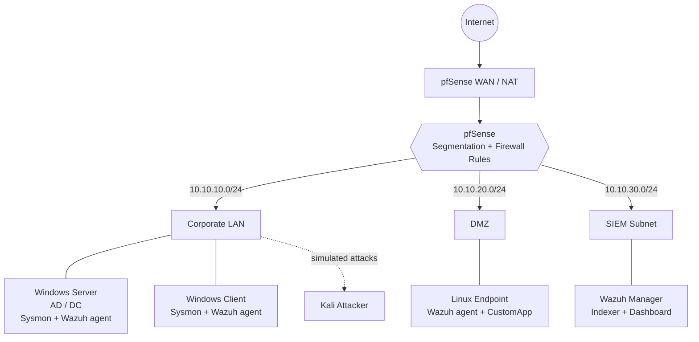

# SOC Detection Lab — Segmented Network, Wazuh SIEM & Custom Detections

> 🚧 **Work in progress.** Building this lab out phase by phase — see the commit history.

Building a security operations lab from scratch: a **pfSense-segmented network**
(Corporate LAN / DMZ / SIEM subnet), centralized detection with **Wazuh** across
**Windows (Active Directory)** and **Linux** endpoints, **custom decoders and
correlation rules**, and detections validated against **simulated attacks** and
mapped to **MITRE ATT&CK**.

## Planned architecture

## Goals
- **Network segmentation & firewall policy design** — isolated LAN / DMZ / SIEM zones (pfSense)
- **SIEM operations** — centralized log collection and triage across Windows + Linux (Wazuh)
- **Detection engineering** — hand-written XML decoders and multi-stage correlation rules
- **Adversary emulation** — simulated attacks, each validated against a detection and mapped to MITRE ATT&CK

## Stack
Kali Linux (host) · VirtualBox · pfSense · Wazuh 4.14 · Windows Server (Active
Directory) · Sysmon · Ubuntu · Kali (attacker) · C# / .NET 8

## Status
Build in progress. Documentation, custom detections, and attack writeups are added
to this repo as each phase is completed.
