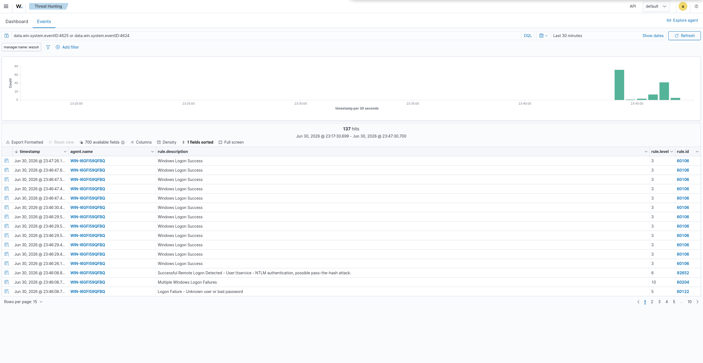

# T1110 - Brute Force → Account Compromise (SMB / Active Directory)

Incident-report-style writeup of a credential-access attack run from the Kali
attacker against the lab domain controller, and how the SIEM detected it.

| | |
|---|---|
| **MITRE technique** | T1110 - Brute Force |
| **Tactic** | Credential Access |
| **Target** | `WIN-I6GFI59QFBQ` (Domain Controller, `lab.local`, 10.10.10.10) |
| **Attacker** | Kali, 10.10.10.50 (assumed-breach position on the corporate LAN) |
| **Detecting rules** | 60122 → 60204 → 92652 (Wazuh built-in Windows ruleset) |
| **Log source** | Windows Security channel (Event ID 4625 / 4624) via Wazuh agent |
| **Severity reached** | Level 10 (brute force) + a flagged suspicious success |

## Objective
Detect repeated failed authentications against a domain account from a single
source, and - critically - the successful logon that follows, which is the
signature of a brute-force attack that worked.

## Attacker actions
From the Kali attacker on the corporate LAN, a small password list was sprayed
against the domain controller's SMB service using NetExec:

```bash
# password candidates, weak-first to generate failures before the hit
printf 'admin\nPassword123\nWelcome1\nLetmein1\nSummer2025\nP@ssw0rd\nchangeme\nabc123\nQwerty123\ntservice2024\nPassword1\n' > pw.txt

# brute-force the tservice account over SMB against the DC
nxc smb 10.10.10.10 -u tservice -p pw.txt --continue-on-success
```

The `tservice` account was configured with the weak password `Password1`, so the
spray ended in a successful authentication:

```
SMB  10.10.10.10  445  WIN-I6GFI59QFBQ  [*] Windows Server 2022 Build 20348 (name:WIN-I6GFI59QFBQ) (domain:lab.local)
SMB  10.10.10.10  445  WIN-I6GFI59QFBQ  [-] lab.local\tservice:admin        STATUS_LOGON_FAILURE
SMB  10.10.10.10  445  WIN-I6GFI59QFBQ  [-] lab.local\tservice:Welcome1     STATUS_LOGON_FAILURE
SMB  10.10.10.10  445  WIN-I6GFI59QFBQ  [+] lab.local\tservice:Password1
```

## What was logged
Each failed SMB authentication generated a Windows **Event ID 4625** (failed
logon) on the DC; the successful one generated **Event ID 4624** (successful
logon). The Wazuh agent forwarded the Security channel to the manager, where the
built-in Windows ruleset processed them.

## Detection logic
The built-in ruleset caught the full progression, escalating severity as the
pattern emerged:

| Rule | Level | Meaning |
|---|---|---|
| **60122** | 5 | *Logon Failure - Unknown user or bad password.* Each individual failed guess (Event 4625). |
| **60204** | 10 | *Multiple Windows Logon Failures.* Correlation rule - fires when failures from a source cross a threshold. **This is the brute-force detection.** |
| **92652** | 6 | *Successful Remote Logon Detected - NTLM authentication, possible pass-the-hash.* Flags the success following the failures as suspicious. |

The key alert for a SOC analyst is **60204 (level 10)**: it converts a stream of
individually-low-severity failures into a single "someone is brute-forcing an
account" signal. The adjacent **92652** is what turns a routine brute-force alert
into an incident - it says the attempt may have *succeeded*.

## Alert


*Threat Hunting → Events, filtered to Windows logon events (4625/4624). The
timeline histogram shows the attack burst; the event table shows the 60122 →
60204 → 92652 progression on agent `WIN-I6GFI59QFBQ`.*

## Analyst notes (triage & response)
How I would work this alert on shift:

**Triage**
- The level-10 `60204` alert is the trigger. First question: is the source
  (`10.10.10.50`) a known host - a vulnerability scanner, an admin jump box, or
  something unexpected? Here it is unexpected, on the corporate LAN.
- Check the targeted account: `tservice`. A service account being brute-forced
  over SMB is not normal user behaviour.
- The `92652` success alert is the escalation point - a failed-failed-failed-**success**
  pattern from one source strongly suggests the credential was guessed.

**Containment**
- Disable or force-reset the `tservice` account immediately; treat it as
  compromised until proven otherwise.
- Block the source IP (`10.10.10.50`) at pfSense to cut further access.
- Check for lateral movement: did that source authenticate anywhere else, or did
  `tservice` log on to other hosts after the success?

**Hardening (root cause)**
- Enforce an **account lockout policy** so a spray like this locks the account
  before it succeeds (the single most effective control against this attack).
- Replace the weak service-account password with a long, random one; where
  possible, use a **group managed service account (gMSA)** so no static password
  exists to guess.
- The DC's host firewall was open to SMB from the whole LAN in this lab; in
  production, restrict SMB to only the hosts that legitimately need it.

**Detection improvement**
- The built-in rules fired well here. A useful tuning would be to raise the
  severity of `92652` when it directly follows a `60204` from the *same source
  IP* within a short window - that specific sequence is far more alarming than
  either alert alone, and correlating them would surface the "brute force that
  worked" as a single high-severity incident.
