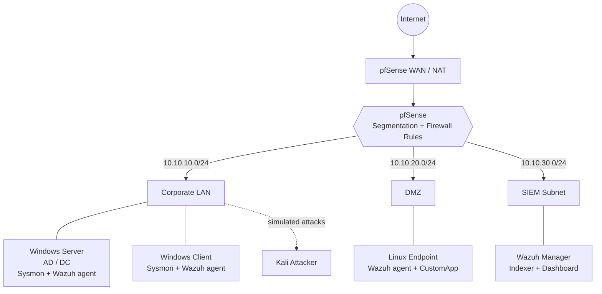

# 01 — Network Design

## Segments
| Segment | Subnet | Gateway (pfSense) | VirtualBox network | Hosts |
|---|---|---|---|---|
| WAN | DHCP via NAT | — | NAT | pfSense uplink |
| Corporate LAN | 10.10.10.0/24 | 10.10.10.1 | Internal `corp-lan` | DC, Windows client |
| DMZ | 10.10.20.0/24 | 10.10.20.1 | Internal `dmz` | Linux endpoint |
| SIEM | 10.10.30.0/24 | 10.10.30.1 | Internal `siem` | Wazuh manager |
| Management | 192.168.56.0/24 | host-only | Host-Only `vboxnet0` | GUI access from host |

## Design intent
The network is split into purpose-built segments so that a compromise in one zone cannot
trivially spread to the others — pfSense sits between every segment and enforces a default-deny
policy, with traffic only permitted where there is a documented reason for it. The **DMZ** is
deliberately isolated from the **Corporate LAN**: an exposed or intentionally weakened host in
the DMZ has no path into the internal network where the domain controller and workstations live,
which contains blast radius if that host is breached. The **SIEM subnet** is kept separate so the
monitoring stack is protected from the hosts it watches; endpoints reach the Wazuh manager only
over the specific ports required for agent enrollment and log forwarding (1514/1515/55000), and
nothing else routes in. Finally, a host-only **Management** network provides out-of-band access to
the pfSense and Wazuh web consoles, so administration never has to traverse the production
segments — mirroring how real environments separate the management plane from data-plane traffic.

## Topology

*Management network (`192.168.56.0/24`, VirtualBox host-only) omitted from the diagram for
clarity — it connects the host directly to the pfSense and Wazuh consoles and carries no
production traffic.*
