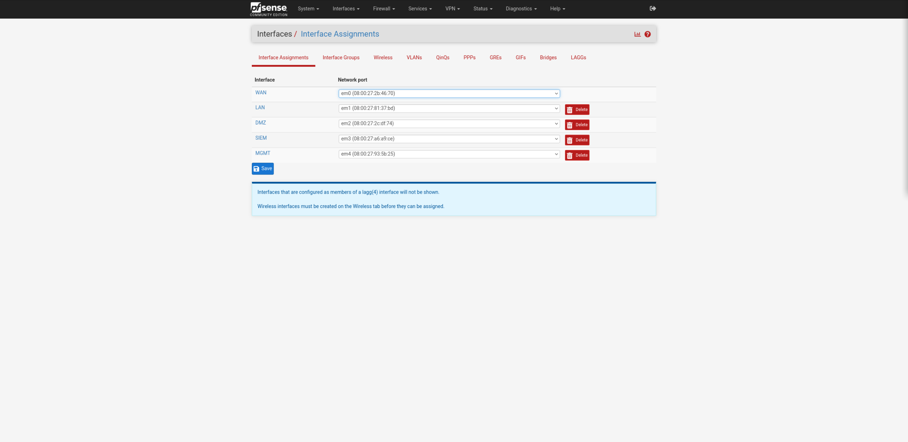
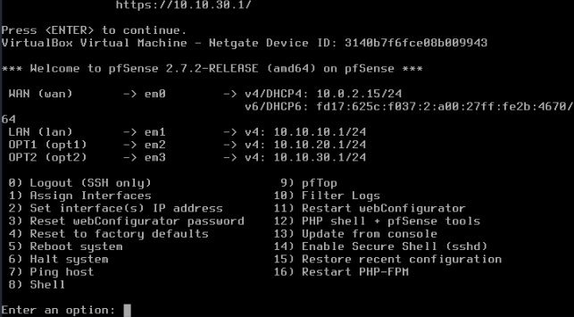
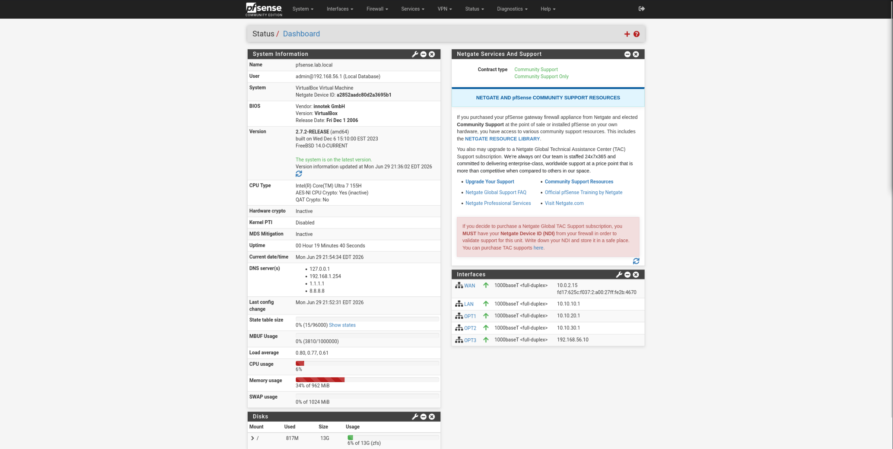
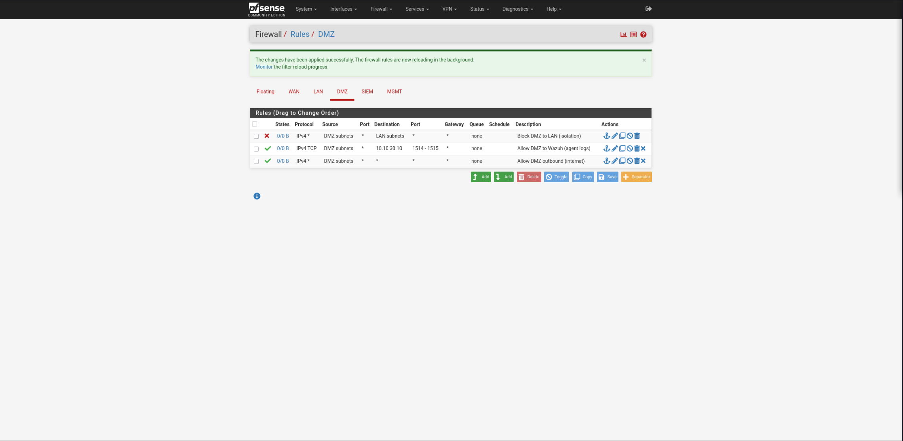
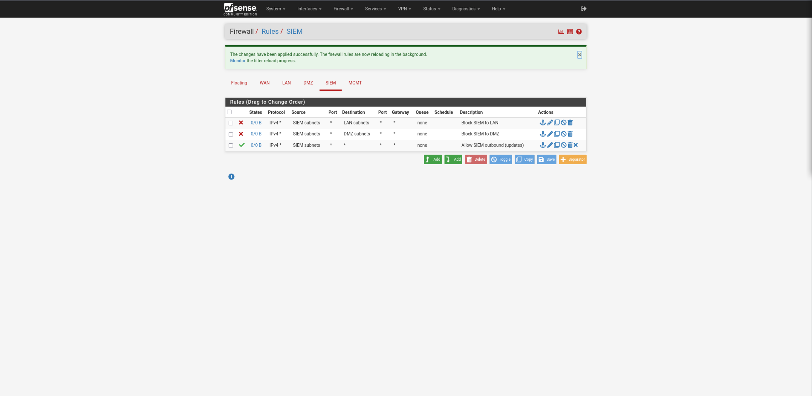
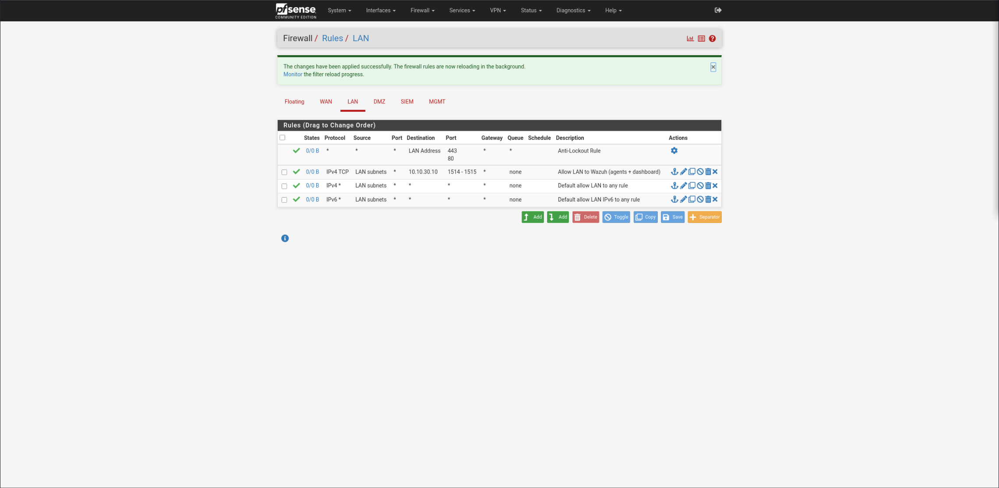

# 02 — pfSense Segmentation & Firewall Policy

pfSense routes and filters between five interfaces, enforcing isolation between the Corporate LAN, DMZ, and SIEM segments. Each segment is a separate VirtualBox Internal Network attached to its own pfSense NIC; an out-of-band host-only **MGMT** interface provides GUI access from the host without traversing production traffic.

## Interface assignment

| Interface | NIC | Subnet | Role |
| - | - | - | - |
| WAN | em0 | DHCP via NAT (10.0.2.x) | Internet uplink |
| LAN | em1 | 10.10.10.0/24 | Corporate LAN (DC, Windows client) |
| DMZ | em2 | 10.10.20.0/24 | Semi-exposed zone (Linux endpoint) |
| SIEM | em3 | 10.10.30.0/24 | Monitoring network (Wazuh) |
| MGMT | em4 | 192.168.56.0/24 | Out-of-band management (host-only) |

  

## Firewall rules and why each exists

pfSense filters traffic **entering** each interface, top-down, first match wins. The LAN ships with a default allow-any rule; OPT interfaces (DMZ/SIEM) are default-deny, so every permitted flow is explicit.

### DMZ (`10.10.20.0/24`)

| \# | Action | Source | Destination | Ports | Purpose |
| - | - | - | - | - | - |
| 1 | Block | DMZ net | LAN net | any | DMZ must not reach the corporate LAN (isolation) |
| 2 | Pass | DMZ net | 10.10.30.10 | 1514–1515 | DMZ endpoint → Wazuh (agent logs) |
| 3 | Pass | DMZ net | any | any | DMZ outbound (internet) |

The block sits above the allows, so any DMZ→LAN traffic is dropped before it can match a pass rule.

### SIEM (`10.10.30.0/24`)

| \# | Action | Source | Destination | Ports | Purpose |
| - | - | - | - | - | - |
| 1 | Block | SIEM net | LAN net | any | SIEM cannot pivot into the LAN it monitors |
| 2 | Block | SIEM net | DMZ net | any | SIEM cannot pivot into the DMZ it monitors |
| 3 | Pass | SIEM net | any | any | SIEM outbound (updates / threat intel) |

Agents reach the SIEM via rules on the LAN/DMZ interfaces (where that traffic enters pfSense), so these SIEM-interface blocks don't interfere with log collection — they only constrain connections the SIEM box itself originates.

### LAN (`10.10.10.0/24`)

| \# | Action | Source | Destination | Ports | Purpose |
| - | - | - | - | - | - |
| 1 | Pass (auto) | \* | LAN address | 443, 80 | Anti-lockout (GUI access) |
| 2 | Pass | LAN net | 10.10.30.10 | 1514–1515 | LAN agents + dashboard → Wazuh |
| 3 | Pass | LAN net | any | any | Default allow LAN to any (internet, DNS, dashboard 443) |

The trusted LAN keeps the default allow-any, with an explicit Wazuh rule above it to document the SIEM relationship.

> Note: ports `55000` (Wazuh API) and `443` (dashboard) are reached via the LAN default allow-any rule; the explicit 1514–1515 rules document the agent-enrollment/log path. These can be tightened into a port alias later if a stricter LAN policy is desired.

## Validation

**Configured (this phase):** default-deny on OPT interfaces with explicit, ordered allow/block rules; the DMZ→LAN and SIEM→LAN/DMZ blocks are in place and applied (confirmed by pfSense's "changes applied successfully" and the per-rule state counters on each rules page).

**Live block test (demonstrated in Phase 6):** once the Linux endpoint exists on the DMZ segment, isolation is proven from a real host — `ping 10.10.10.10` (the DC on the LAN) **fails** while `ping 8.8.8.8` (internet) **succeeds**, and `nc -vz 10.10.30.10 1514` (Wazuh) **succeeds**. That captured result is added here as `screenshots/06-dmz-isolation-proof.png`, turning the configured policy into demonstrated segmentation.

