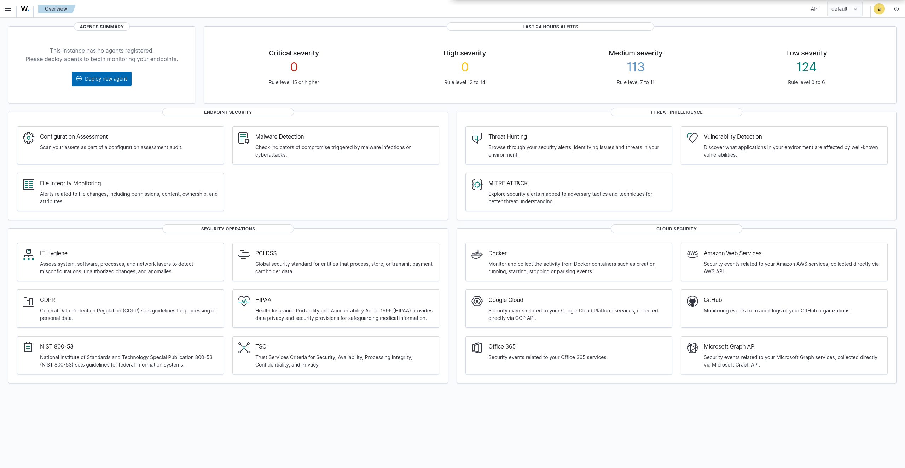

# 03 — Wazuh Deployment

The SIEM is a single Ubuntu Server 22.04 LTS host running the Wazuh all-in-one stack
(indexer + manager + filebeat + dashboard). It sits on the **SIEM segment** and is reached
for administration over a separate out-of-band management network, mirroring the dual-homed
pattern used by pfSense.

## Host configuration

| Property | Value |
|---|---|
| OS | Ubuntu Server 22.04.5 LTS |
| vCPU / RAM | 2 vCPU / 6 GB |
| Disk | 50 GB (SATA/AHCI) |
| SIEM NIC (enp0s3) | `10.10.30.10/24`, gateway `10.10.30.1` (pfSense) |
| MGMT NIC (enp0s8) | `192.168.56.20/24`, no gateway (host-only) |
| Wazuh version | 4.14.5 |

Only the SIEM interface has a default gateway, so all routed traffic (package downloads,
agent enrollment) flows through pfSense and is subject to its firewall policy. The host-only
interface exists purely so the dashboard can be reached from the host browser without
exposing it to the lab segments.

## Installation

```bash
curl -sO https://packages.wazuh.com/4.14/wazuh-install.sh
sudo bash ./wazuh-install.sh -a
```

The `-a` flag performs an unattended all-in-one install: it generates certificates, installs
and starts the indexer, manager, filebeat, and dashboard, and prints the admin credentials in
a final summary. Access:

- Dashboard: `https://192.168.56.20` (self-signed certificate)
- Default user: `admin`

Credentials are also recoverable on the host:

```bash
sudo tar -O -xvf wazuh-install-files.tar wazuh-install-files/wazuh-passwords.txt
```

## Troubleshooting: dashboard install failed (disk full)

The first install run completed the indexer and manager, then failed at the dashboard step:

```
ERROR: Wazuh dashboard installation failed.
```

Root cause was found in `/var/log/wazuh-install.log`:

```
dpkg-deb: error: paste subprocess was killed by signal (Broken pipe)
... disk full error
```

The dashboard package unpacks ~1 GB, and the root filesystem ran out of space mid-unpack —
**not** a RAM issue (`free -h` showed plenty of memory free). The cause was Ubuntu's guided
LVM install, which allocated only **24 GB of the 50 GB disk** to the root logical volume,
leaving the rest unallocated in the volume group:

```
/dev/mapper/ubuntu--vg-ubuntu--lv   24G  ...  /
```

On failure the installer automatically rolled back all components, leaving a clean system.

### Fix — extend the root logical volume to fill the disk

```bash
sudo lvextend -l +100%FREE /dev/ubuntu-vg/ubuntu-lv
sudo resize2fs /dev/ubuntu-vg/ubuntu-lv
df -h /            # root now ~48 GB
```

Then re-run with the overwrite flag so the rolled-back artifacts don't block reinstall:

```bash
curl -sO https://packages.wazuh.com/4.14/wazuh-install.sh
sudo bash ./wazuh-install.sh -a -o
```

The second run completed all four components successfully.

> **Lesson:** Ubuntu's default guided LVM layout does not use the whole disk. For any server
> role that unpacks large packages, extend the LV to `+100%FREE` immediately after install,
> before deploying software.

## Post-install hardening

Disable the Wazuh apt repository so an unattended background upgrade can't change versions
mid-project and destabilise the lab:

```bash
sudo sed -i "s/^deb /#deb /" /etc/apt/sources.list.d/wazuh.list
sudo apt update
```

Service health can be confirmed with:

```bash
sudo systemctl status wazuh-indexer wazuh-manager filebeat wazuh-dashboard
```

## Result

The dashboard loads over the management interface and authenticates with the admin account.
With no agents enrolled yet, the overview reflects a clean day-one baseline — the starting
point before endpoints are onboarded in later phases.


