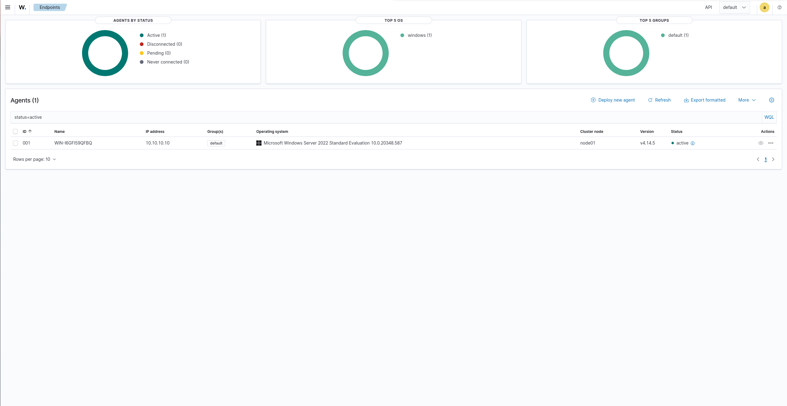

# 04 — Active Directory & Endpoint Telemetry

The corporate LAN is anchored by a Windows Server 2022 domain controller running the
`lab.local` Active Directory forest. The DC also serves DNS for the domain, hosts the lab
user accounts, and runs Sysmon plus the Wazuh agent so that Windows security events and
detailed endpoint telemetry are forwarded to the SIEM.

## Domain controller

| Property | Value |
|---|---|
| OS | Windows Server 2022 Standard (Desktop Experience), Evaluation |
| Role | AD DS + DNS (new forest) |
| Forest / domain | `lab.local` (NetBIOS `LAB`) |
| IP (LAN) | `10.10.10.10/24`, gateway `10.10.10.1` (pfSense) |
| DNS | `127.0.0.1` (the DC is its own domain DNS) |
| Network | VirtualBox Internal Network `corp-lan` |

A domain controller must have a static IP and point DNS at itself, because AD relies on DNS
to advertise and locate domain services. The single LAN NIC reaches the internet and the
SIEM through pfSense, subject to the firewall policy from Phase 2.

## Install notes (VirtualBox)

Two issues worth recording, both firmware/boot related:

- **The VM would not boot the first ISO.** An OEM-repackaged Windows ISO
  (`...SERVER_LOF_PACKAGES_OEM.iso`) failed under both legacy BIOS ("No bootable medium")
  and UEFI ("BdsDxe: failed to load ... CD-ROM"). The boot files on that image were not
  UEFI-bootable. The fix was to use the **official Microsoft Evaluation Center ISO**
  (`SERVER_EVAL_x64FRE_en-us.iso`), which boots cleanly.
- **Firmware must be EFI.** With `VBoxManage modifyvm DC01 --firmware efi`, the official ISO
  boots straight into Windows Setup with no "press any key" timing window.

> **Lesson:** prefer the official vendor ISO; OEM/repackaged images often have broken boot
> media. Match VM firmware (EFI) to the image.

## Promotion to domain controller

1. **Server Manager → Add Roles and Features →** Active Directory Domain Services → Install.
2. **Promote this server to a domain controller →** *Add a new forest* → root domain
   `lab.local`.
3. Set a Directory Services Restore Mode (DSRM) password; leave DNS server checked.
4. Accept the benign prerequisite warnings (DNS delegation, etc.) → Install → automatic reboot.

After reboot, sign-in is as the domain account `LAB\Administrator`.

## Users

Created an OU `LabUsers` containing the lab accounts:

| User | Logon | Password | Purpose |
|---|---|---|---|
| John Smith | `jsmith` | strong | ordinary domain user |
| Mary Jones | `mjones` | strong | ordinary domain user |
| Test Service | `tservice` | `Password1` (weak) | **brute-force attack target** |

`tservice` deliberately uses a weak, guessable password that still technically satisfies AD's
default complexity policy. It is the intended target for the credential-attack simulation in a
later phase, where the authentication-failure detections are expected to fire.

## Sysmon

Sysmon (Sysinternals) provides high-fidelity endpoint telemetry — process creation with
command lines and hashes, network connections, DNS queries, file and registry activity —
well beyond the default Windows logs. It is deployed with the community **SwiftOnSecurity**
configuration, which filters noise to a useful signal.

```powershell
mkdir C:\Sysmon; cd C:\Sysmon
Invoke-WebRequest "https://download.sysinternals.com/files/Sysmon.zip" -OutFile Sysmon.zip
Expand-Archive .\Sysmon.zip -DestinationPath .\
Invoke-WebRequest "https://raw.githubusercontent.com/SwiftOnSecurity/sysmon-config/master/sysmonconfig-export.xml" -OutFile sysmonconfig.xml
.\Sysmon64.exe -accepteula -i sysmonconfig.xml
```

Verified with:

```powershell
Get-WinEvent -LogName "Microsoft-Windows-Sysmon/Operational" -MaxEvents 5
```

## Wazuh agent

The agent ships Windows security events and the Sysmon channel to the manager on the SIEM
segment.

```powershell
msiexec.exe /i wazuh-agent-4.14.5-1.msi /q WAZUH_MANAGER="10.10.30.10" WAZUH_AGENT_NAME="DC01"
NET START WazuhSvc
```

Agent → manager traffic (ports 1514–1515) crosses from the LAN to the SIEM segment and is
permitted by the Phase 2 LAN rule that allows the LAN to reach `10.10.30.10` — so endpoint
enrollment validates the segmentation policy in practice rather than just on paper.

## Result

The DC enrolls and reports as an **active** agent in the Wazuh dashboard, identified by its
Windows hostname on `10.10.10.10`, running agent v4.14.5 — the point at which the domain
begins streaming telemetry into the SIEM.


